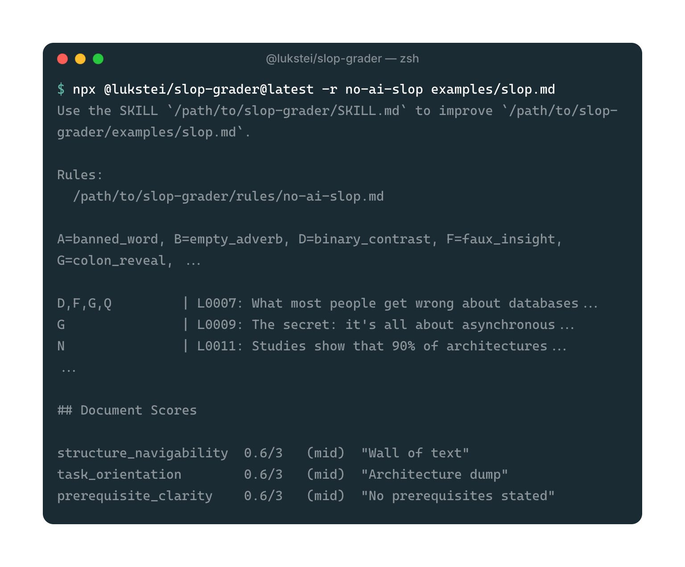

# slop-grader


[](https://www.npmjs.com/package/@lukstei/slop-grader)
[](https://www.npmjs.com/package/@lukstei/slop-grader)
[](https://www.npmjs.com/package/@lukstei/slop-grader)
[](https://opensource.org/licenses/MIT)

Rule-based slop grader for text files, powered by [Jev](https://typesafe.ai).
Runs every rule against every line in parallel. No skimming, no missed lines.

- [How it works](#how-it-works)
- [Features](#features)
- [FAQ](#faq)
- [Quick Start](#quick-start)
- [Rulesets](#rulesets)
- [CLI Reference](#cli-reference)
- [Output Formats](#output-formats)
- [Development](#development)
- [Changelog](#changelog)
- [Contributing](#contributing)
- [Roadmap](#roadmap)

## How it works

`slop-grader` runs as a two-step loop: grade text with the CLI, then paste the output to your AI agent to plan the improvements.

### 1. Grade the document

Run `slop-grader` on a document like [`examples/slop.md`](examples/slop.md):

```sh
npx @lukstei/slop-grader@latest -r no-ai-slop examples/slop.md
```



### 2. Fix with an AI agent

Pass the output to your AI agent:

- The agent distinguishes real violations from false positives and generates concrete replacements ([Example with Gemini 3.8 Flash](examples/plan.md)):
  > **Line 1 — `banned_word`**
  > - **Original:** `# 🚀 The Ultimate Paradigm Shift in Modern Data Architecture`
  > - **Fix:** `# Modern Data Architecture`
  > - **Reason:** Removes the banned phrase "paradigm shift" and decorative emoji.
  >
  > **Line 7 — `binary_contrast` + `faux_insight` + `colon_reveal`**
  > - **Original:** `What most people get wrong about databases is simple: it's not about speed, it's about trust.`
  > - **Fix:** `Database design balances speed and trust.`
  > - **Reason:** Removes rhetorical framing and fake insight.

- After your review the plan is applied to produce an [improved document](examples/slop-improved.md).

## Features

- **[Parallel exhaustive grading](#how-is-this-different-from-using-an-llm-to-check-text):** Checks every rule against every line independently. No skimming.
- **[Incremental line caching](#how-does-incremental-caching-work):** Re-evaluates only edited lines; unchanged text resolves from cache with zero API calls. Toggle with `--no-cache`.
- **System One efficiency:** Typed probabilities via [Jev](https://typesafe.ai) without text generation. Thousands of checks for cents.
- **Dynamic batching:** Groups lines to token limits to minimize API calls. See [evaluation details](#faq).
- **[Line and document scope](#rulesets):** Flags line patterns and rates whole documents on qualitative rubrics.
- **Plain Markdown rulesets:** Write rules in [Markdown](#custom-rulesets); validate offline with [`--check`](#flags).
- **[Built-in rulesets](#built-in-rulesets):** Ready-to-use rules for AI writing patterns, document scores, tech docs, and grammar.
- **Agent and CI ready:** [Terminal output](#human-readable-report) for [agent fix plans](examples/plan.md); [structured JSON](#json-report---json) for pipelines.
- **[Multi-provider](#providers-and-environment-variables):** Works with TypeSafe AI and OpenRouter out of the box.

## FAQ

<details>
<summary><a id="how-does-evaluation-work"></a><strong>How does evaluation work?</strong></summary>

Evaluation separates line-level checks (spotting specific patterns or phrases) from document-level checks (evaluating tone or overall structure).

Documents have hundreds of lines, but the number of rules is fixed. Sending one API request per line would mean hundreds of calls. Instead, `slop-grader` dynamically groups lines into batches sized to fit the model's context budget (up to 255 lines per batch) and evaluates each rule across its batch in a single call. Every batch response is verified for complete answer-to-question parity; any dropped questions halt execution immediately without caching incomplete results.

Document rules run in a single request across the entire text.

</details>

<details>
<summary><a id="how-does-incremental-caching-work"></a><strong>How does incremental caching work?</strong></summary>

Line evaluations are cached by the hash of the line's content and the rule's criteria.

When you edit a document and run `slop-grader` again:
1. Every line is matched against the local cache for each rule.
2. Unchanged lines resolve immediately from the cache with zero API calls and zero cost.
3. Only new or modified lines are batched and sent to the model.
4. If a rule's instructions or criteria change, its cache invalidates automatically.

This makes repeated runs on large files or during editing loops nearly instantaneous. Pass `--no-cache` to bypass the cache, or `--cache-dir <dir>` to customize its location. See [`docs/CACHE.md`](docs/CACHE.md) for technical details on storage layout, hashing, and eviction.

</details>

<details>
<summary><a id="how-is-this-different-from-using-an-llm-to-check-text"></a><strong>How is this different from using an LLM to check text?</strong></summary>

Standard generative LLMs evaluate an entire document in a single prompt against a list of rules. On longer texts, they skip lines, miss rules, and report wrong line numbers.

Running a separate check for every line and rule with a generative LLM is impractical. A 300-line draft tested against 10 rules would require 3,000 text-generation requests, which is slow and expensive.

`slop-grader` uses a System One model ([Jev](https://typesafe.ai)). System One models answer discrete semantic questions with typed probabilities without generating text. Because these judgments return numbers instead of prose tokens, `slop-grader` can test every line against every rule separately and in parallel.

</details>

<details>
<summary><a id="how-much-does-it-cost-to-check-a-file"></a><strong>How much does it cost to check a file?</strong></summary>

Cost scales with the number of rules and non-empty lines.

Checking [`examples/slop.md`](examples/slop.md) (16 text lines) against 53 rules costs roughly \$0.0053 (half a cent):

```
Rules applied:                53 (48 line, 5 document)
Lines evaluated:              16
Questions asked:              773
API calls:                    49
Questions evaluated via API:  773
```

Checking a 2,100-word article (300 text lines) against 42 rules costs roughly \$0.076 (7.6 cents):

```
Rules applied:                42
Lines evaluated:              300
Questions asked:              12600
API calls:                    84
Questions evaluated via API:  12600
```

Re-evaluating an edited document only costs for changed lines, unchanged lines resolve from cache with zero API calls.

Because Jev evaluates semantic probabilities instead of generating text tokens, running thousands of parallel checks costs a fraction of standard LLM generation.

</details>

<details>
<summary><strong>Can I use custom rules for my use case?</strong></summary>

Yes. You can write custom rules in Markdown (`-r ./my-rules.md`) or JSON. Rules ask plain-text questions about a single line or the whole document, evaluated against criteria you define. See [Custom rulesets](#custom-rulesets) in the [Rulesets](#rulesets) section for syntax details and validation instructions.

</details>

<details>
<summary><strong>Which use cases exist for this tool?</strong></summary>

`slop-grader` works on any plain text, structured file, or code diff:

- Catch AI writing habits, filler adverbs, and rhetorical formulas in drafts and essays.
- Check technical documentation for missing code examples, disorganized steps, or unexplained jargon.
- Scan code review diffs for swallowed errors, hardcoded credentials, and unjustified type assertions.
- Audit CSV spreadsheets and transaction logs for values exceeding approval thresholds.
- Review contracts and legal agreements for uncapped indemnification obligations.
- Check customer support transcripts for unreleased feature commitments or unauthorized discounts.
- Evaluate incident postmortems to confirm they address systemic defenses instead of individual human error.

See the [Rulesets](#rulesets) section for pre-built rules and example templates.

</details>

## Quick Start

### Requirements

- Node.js 18+
- An API key for your chosen provider:
  - `TYPESAFE_API_KEY` — [typesafe.ai](https://typesafe.ai) (uses `jev` provider)
  - `OPENROUTER_API_KEY` — [openrouter.ai](https://openrouter.ai) (uses `openrouter` provider)

### Run

```sh
export TYPESAFE_API_KEY=...
npx @lukstei/slop-grader@latest -r no-ai-slop -r article-scores my-draft.md
```

## Rulesets

### Built-in rulesets

List built-in rulesets directly with `--list-rulesets` (or `-l`):

```sh
npx @lukstei/slop-grader@latest --list-rulesets
# or with structured JSON including rule IDs:
npx @lukstei/slop-grader@latest -l --json
```

Pass built-in rulesets by name (`-r article-scores`):

| Ruleset | What it checks |
|---|---|
| [`article-scores`](rules/article-scores.md) | Document-level scores: engagement, narrative arc, closing strength |
| [`tech-docs`](rules/tech-docs.md) | Technical documentation patterns: structure, task orientation, completeness, code examples, minimizing complexity |
| [`grammar-english`](rules/grammar-english.md) | English grammar: spelling and confused words, agreement, verb tenses, prepositions, pronouns, sentence structure, comparatives |
| [`grammar-german`](rules/grammar-german.md) | German grammar: spelling and confused words, agreement and inflection, word order, punctuation and typography |
| [`no-ai-slop`](rules/no-ai-slop.md) | Banned words, empty adverbs, puffery, colon reveals, bold lead-in lists, weasel attribution, dramatic fragmentation |

### Custom rulesets

Define custom rules in Markdown (`-r ./my-rules.md`), organized under `# Line Rules` and `# Document Rules` sections.

You can be creative and ask any plain-text question about a single line or the whole document. Rules work on any text, git diffs, server logs, legal contracts, or structured text like CSV files:

```markdown
# Line Rules

## empty_adverb
Does the line use an adverb that adds nothing to the meaning?

### Criteria
- **true**: The adverb could be deleted without changing the sentence.
- **false**: The adverb carries real emphasis or spoken rhythm.

# Document Rules

## narrative_arc
Rate the narrative arc of the document.

### Criteria
- No clear arc — sections feel disconnected
- Loosely organized — a theme but no build
- Clear progression — each section sets up the next
- Tight arc — the ending pays off the opening
```

#### Keep rules granular

Test one pattern per rule. Bundling typos, word choice, and punctuation into a single check hurts model precision, hides which condition triggered in the report, and makes rules harder to tune without regressions. A specific rule ID like `compound_spacing` (instead of a generic `spelling`) shows immediately what failed.

#### Inspirations for rulesets

<details>
<summary><strong>Structured text (CSV transaction audit)</strong></summary>

```markdown
# Line Rules

## suspicious_refund
Does this CSV transaction row show a refund exceeding $500 without a manager approval ID in column 6?

### Criteria
- **true**: The row records a refund over $500 and column 6 lacks an approval ID.
- **false**: The amount is $500 or less, column 6 contains an approval ID, or the row is not a refund.
```

</details>

<details>
<summary><strong>Incident postmortems (systemic analysis)</strong></summary>

```markdown
# Document Rules

## root_cause_depth
Evaluate whether this postmortem addresses systemic engineering safeguards instead of individual human error.

### Criteria
- Blames operator error without addressing missing guardrails
- Identifies immediate triggers but ignores underlying architecture
- Identifies failure modes and plans concrete monitoring or test coverage
- Proposes systemic automated defenses, blast-radius containment, and architectural fixes
```

</details>

<details>
<summary><strong>Legal agreements (contract risks)</strong></summary>

```markdown
# Line Rules

## uncapped_indemnity
Does this clause expose the company to uncapped indemnification for third-party claims?

### Criteria
- **true**: The clause creates an indemnification obligation without liability caps.
- **false**: The obligation falls under the standard aggregate liability limit.
```

</details>

<details>
<summary><strong>Customer conversations (support transcripts)</strong></summary>

```markdown
# Line Rules

## unauthorized_promise
Does this agent response promise an unreleased feature date or custom contract concession?

### Criteria
- **true**: Agent commits to an unannounced date or non-standard term.
- **false**: Agent refers customer to public docs or defers to account managers.
```

</details>

<details>
<summary><strong>Code review (unjustified type assertions)</strong></summary>

```markdown
# Line Rules

## unjustified_type_cast
Does this line use a type assertion (`as`), non-null assertion (`!`), or loose cast to silence a compiler error without proper narrowing or input validation?

### Criteria
- **true**: Casts away type safety without an upstream type guard, schema validation, or explanatory comment.
- **false**: Type is narrowed safely, or the assertion bridges an external API boundary with runtime checks.
```

</details>

<details>
<summary><strong>Security audit (hardcoded credentials and secrets)</strong></summary>

```markdown
# Line Rules

## hardcoded_secret
Does this line contain a hardcoded API key, bearer token, private key, or password rather than referencing an environment variable or secret manager?

### Criteria
- **true**: Line contains a literal credential, private token, or hardcoded secret string.
- **false**: Line references an environment variable, config placeholder, mock test fixture, or public key.
```

</details>

<details>
<summary><strong>Code quality (silent error swallowing)</strong></summary>

```markdown
# Line Rules

## swallowed_error
Does this catch block or fallback expression silence an unexpected error without diagnostic logging or recovery?

### Criteria
- **true**: Catches an exception and returns null or an empty default without logging context.
- **false**: Logs the error with context, rethrows, or implements a documented recovery strategy.
```

</details>

<details>
<summary><strong>Git workflow (commit message intent)</strong></summary>

```markdown
# Document Rules

## commit_intent
Does this commit message or PR description explain the motivation and problem context rather than merely describing code changes?

### Criteria
- Mechanical change list only with no rationale
- Mentions the fix with minimal explanation of the problem
- Explains the failure trigger, bug condition, and rationale clearly
- Details root cause, design tradeoffs considered, and verification evidence
```
</details>


See [`docs/SYNTAX.md`](docs/SYNTAX.md) for the complete Markdown rule syntax specification and validation reference.

Validate ruleset syntax offline without an API key:

```sh
npx @lukstei/slop-grader@latest --check -r ./my-rules.md
```

Use the [`create-slop-grader-rules`](skills/create-slop-grader-rules/SKILL.md) skill to create and validate custom rulesets with an AI assistant.

Custom JSON rulesets (`-r ./my-rules.json`) are also supported.

## CLI Reference

```sh
npx @lukstei/slop-grader@latest [-c|--check] [-l|--list-rulesets] -r <ruleset> [-r <ruleset> ...] [--provider <jev|openrouter>] [--model <model>] [--json] [--stats] [--debug] [--no-cache] [--cache-dir <dir>] [-h|--help] [-v|--version] [file]
```

### Flags

| Flag | Short | Description |
|---|---|---|
| `--list-rulesets` | `-l` | List built-in rulesets and descriptions. |
| `--check` | `-c` | Validate ruleset syntax without grading or calling the API. |
| `--rules <name\|path>` | `-r` | Ruleset to apply. Repeatable. Accepts built-in names, Markdown (`.md`) files, or JSON file paths. |
| `--provider <jev\|openrouter>` | `-p` | Override the AI provider. |
| `--model <model>` | `-m` | Override the default model (`jev-1.13.0` for `jev`, `typesafe/jev-1.13` for `openrouter`). |
| `--json` | `-j` | Emit structured JSON instead of the human-readable report. |
| `--stats` | `-s` | Print execution statistics (rules applied, lines evaluated, questions asked, API calls, questions evaluated via API, cache hits). |
| `--debug` | `-d` | Log all API calls (timing, request, response) as JSON to stderr. |
| `--no-cache` | | Disable line-level caching (evaluates all lines from scratch). |
| `--cache-dir <dir>` | | Override the cache directory (defaults to OS cache directory). |
| `--help` | `-h` | Display usage information. |
| `--version` | `-v` | Display version number. |

### Providers and environment variables

| Variable | Description |
|---|---|
| `TYPESAFE_API_KEY` | API key for direct Jev access via TypeSafe AI. Automatically selects `jev`. |
| `OPENROUTER_API_KEY` | API key for OpenRouter. Automatically selects `openrouter`. |
| `TYPESAFE_PROVIDER` | Explicitly choose `jev` or `openrouter` without passing `--provider`. |

Provider resolution order:
1. `--provider` (`-p`) flag
2. `TYPESAFE_PROVIDER` environment variable
3. Auto-detected from keys (`TYPESAFE_API_KEY` selects `jev`; `OPENROUTER_API_KEY` selects `openrouter`)

Grading runs on `jev-1.13.0` (TypeSafe) or `typesafe/jev-1.13` (OpenRouter) by default, overridable via `--model` (`-m`).

## Output Formats

### Human-readable report

By default, `slop-grader` prints a human-readable report. Clean lines are omitted; only lines crossing the 0.8 confidence threshold appear. Pass `--stats` (or `-s`) to append execution metrics (rules applied, lines evaluated, API calls).

If line rules run but find no violations, `No line rule violations found.` is displayed.

### JSON report (`--json`)

Pass `--json` (or `-j`) for structured machine-readable output:

```sh
npx @lukstei/slop-grader@latest -r no-ai-slop -r article-scores --json --stats my-draft.txt | jq .
```

```json
{
  "file": "/abs/path/to/my-draft.txt",
  "rules": ["/abs/path/to/no-ai-slop.md"],
  "violations": {
    "lines": [
      { "lineNum": 1, "text": "Our platform empowers teams...", "rules": ["banned_word"] }
    ],
    "document": {
      "narrative_arc": { "score": 1.4, "max": 3, "confidence": 0.72, "label": "Loosely organized" }
    }
  },
  "stats": {
    "rules": 6,
    "lineRules": 5,
    "docRules": 1,
    "lines": 12,
    "questions": 61,
    "apiCalls": 6
  }
}
```

`violations.lines` and `violations.document` are empty when the file is clean. Useful for CI pipelines and editor integrations.

## Development

```sh
npm test         # Run tests
npm run verify   # Run typecheck, biome lint, and tests
npm run build    # Build
```

## Changelog

See [CHANGELOG](docs/CHANGELOG.md) for release history and notable changes.

## Contributing

See [CONTRIBUTING](CONTRIBUTING.md) for contribution guidelines, development setup, and coding best practices.

## Roadmap

Planned features we'd like to bring to slop-grader. Have an idea? [Open an issue](https://github.com/lukstei/slop-grader/issues).

- [x] Structured JSON output with `--json` ([v0.1.5](docs/CHANGELOG.md#v015))
- [x] Execution statistics with `--stats` ([v0.1.6](docs/CHANGELOG.md#v016))
- [x] Custom model override with `--model` ([v0.1.7](docs/CHANGELOG.md#v017))
- [x] Debug payload logging with `--debug` ([v0.1.7](docs/CHANGELOG.md#v017))
- [x] Markdown-authored rulesets ([v0.2.0](docs/CHANGELOG.md#v020))
- [x] Offline ruleset validation with `--check` ([v0.2.0](docs/CHANGELOG.md#v020))
- [x] Document-level scoring rules ([v0.2.1](docs/CHANGELOG.md#v021))
- [x] Ruleset listing with `--list-rulesets` ([v0.2.3](docs/CHANGELOG.md#v023))
- [x] Incremental line-level caching ([v0.2.5](docs/CHANGELOG.md#v025))
- [ ] Local web UI for in-browser grading (`slop-grader --ui`)
- [ ] Official GitHub Action for CI and pull requests
- [ ] Inline pull request review comments and score summaries
- [ ] Markdown mode to skip code blocks and syntax
- [ ] Web playground to test rulesets and generate CLI commands
- [ ] Remediation guidance and fix instructions in reports
- [ ] Expanded rulesets for git commits, PR descriptions, and ADRs
- [ ] Legal and policy document rulesets (Terms of Service, Privacy Policies)
- [ ] Standard input support (`cat doc.md | slop-grader -`)
- [ ] Token usage and estimated API costs in `--stats`
- [ ] Standalone binaries via Homebrew and APT (no Node runtime required)
- [ ] Interactive CLI prompt mode
- [ ] Agent skill installer (`slop-grader init --skill`)
- [ ] JSON and YAML field targeting with JSON Pointers
- [ ] YAML support for authoring rulesets
- [ ] Copy reports directly to clipboard (`--clipboard`)
- [ ] Dry-run mode to inspect payloads without API calls (`--dry-run`)
- [ ] Custom provider base URLs for proxies and self-hosted models (`--base-url`)
- [ ] Custom confidence thresholds per rule
- [ ] Configurable request concurrency (`--concurrency`)
- [ ] Verbose operational logs (`-v` / `--verbose`)

## License

MIT

## Star History

<a href="https://www.star-history.com/?repos=lukstei%2Fslop-grader&type=date&legend=top-left">
 <picture>
   <source media="(prefers-color-scheme: dark)" srcset="https://api.star-history.com/chart?repos=lukstei/slop-grader&type=date&theme=dark&legend=top-left" />
   <source media="(prefers-color-scheme: light)" srcset="https://api.star-history.com/chart?repos=lukstei/slop-grader&type=date&legend=top-left" />
   
 </picture>
</a>
